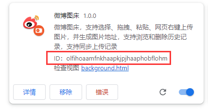

# vue_upload_to_weibo

在 vue 页面中直接上传图片到微博

## 1.导入浏览器插件并复制 ID



获取浏览器插件的 ID

```html
<n-upload
    ref="upload"
    :default-upload="false"
    list-type="image-card"
    multiple
    :default-file-list="previewFileList"
    @before-upload="devUploadImage"
>
    <ion-icon name="add-outline" size="large"></ion-icon>
</n-upload>
<script>
    export default {
        const previewFileList = ref([]);
        // 传入一个File对象返回一个base64字符串
        const getBase64 = (file) => {
          return new Promise((resolve, reject) => {
            const reader = new FileReader();
            reader.readAsDataURL(file);
            reader.onload = () => {
              let res = reader.result;
              resolve(res);
            };
            reader.onerror = (error) => {
              reject(error);
            };
          });
        };

        // 这个函数的作用是将图片上传到微博图床
        const devUploadImage = async (options) => {
          const { file, name } = options.file;
          // 上传图片
          const base64 = await getBase64(file);
          var targetExtensionId = "olfihoaamfnkhaapkjpjhaaphobflohm"; // 插件的ID
          chrome.runtime.sendMessage(
            targetExtensionId,
            {
              type: "UploadToWeibo",
              data: {
                base64,
                fileName: name,
              },
            },
            (response) => {
              console.log("response", response);
              if (response.code == 0) {
                previewFileList.value.push({
                  id: response.data.pid,
                  name: response.data.file_name,
                  status: "finished",
                  url: response.data.url,
                });
              }
              return false;
            }
          );
          return false;
        };
        return {
            previewFileList,
            devUploadImage,
        };
    }
</script>
```
<video src="QQ202391-151843.mp4" controls title="Title"></video>